<div align="center">

# 🤖 Sheikh AI

### The Next-Generation AI Coding Assistant

**Empowering Developers with Intelligent Multi-Agent Architecture**

[English](README.md) | [中文](README_zh.md) | [বাংলা](README_bn.md)

[](https://github.com/likhonsexikh/sheikh-ai/stargazers)
[](https://opensource.org/licenses/MIT)
[](https://github.com/likhonsexikh/sheikh-ai/releases)
[](https://hub.docker.com/r/likhonsexikh/sheikh-ai-backend)

[](https://fastapi.tiangolo.com/)
[](https://vuejs.org/)
[](https://www.typescriptlang.org/)
[](https://www.docker.com/)
[](https://www.mongodb.com/)
[](https://redis.io/)

[🌐 Official Site](https://sheikhAI.com) • [📚 Documentation](https://docs.sheikhAI.com) • [🚀 Try Demo](https://sheikhAI.com) • [💬 Discussions](https://github.com/likhonsexikh/sheikh-ai/discussions) • [🐛 Report Bug](https://github.com/likhonsexikh/sheikh-ai/issues)

</div>

---

## 📖 Overview

**Sheikh AI** is a cutting-edge, general-purpose AI Agent system designed to revolutionize how developers interact with code. Built with a powerful multi-agent architecture, Sheikh AI executes complex tasks in isolated sandbox environments, providing unparalleled safety, flexibility, and intelligence.

### 🎯 What Makes Sheikh AI Different?

- **🔒 Secure Sandbox Execution**: Every task runs in an isolated Docker environment, ensuring complete safety
- **🧠 Intelligent Multi-Agent System**: Advanced PlanAct agents that understand context and plan complex workflows
- **⚡ Real-time Collaboration**: Live viewing and takeover capabilities for all tools (Browser, Terminal, Files)
- **🌍 Multilingual Support**: Full support for English, Chinese, and Bangla
- **🎨 Modern Tech Stack**: Built with FastAPI, Vue 3, TypeScript, and Docker for maximum performance
- **📦 Minimal Dependencies**: Requires only an LLM service - no external dependencies needed

---

### ✨ Why Choose Sheikh AI?

```mermaid
graph LR
    A[👨‍💻 Developer] -->|Writes Code| B[🤖 Sheikh AI]
    B -->|Intelligent Analysis| C[🧠 Multi-Agent System]
    C -->|Executes Safely| D[🐳 Sandbox Environment]
    D -->|Real-time Feedback| A
    
    style A fill:#4caf50,color:#fff
    style B fill:#2196f3,color:#fff
    style C fill:#ff9800,color:#fff
    style D fill:#9c27b0,color:#fff
```



❤️ **Like Sheikh AI? Give it a ⭐ to support active development!**

## Demos

### Basic Features

https://github.com/user-attachments/assets/37060a09-c647-4bcb-920c-959f7fa73ebe

### Browser Use

* Task: Latest LLM papers

<https://github.com/user-attachments/assets/4e35bc4d-024a-4617-8def-a537a94bd285>

### Code Use

* Task: Write a complex Python example

<https://github.com/user-attachments/assets/765ea387-bb1c-4dc2-b03e-716698feef77>


## ⚡ Key Features

<table>
<tr>
<td width="50%">

### 🛠️ **Powerful Tools**
- **🌐 Browser Tool**: Full Chrome automation with live viewing
- **💻 Terminal Tool**: Execute shell commands securely
- **📁 File Manager**: Complete file operations (CRUD)
- **🔍 Web Search**: Integrated search capabilities
- **🔌 MCP Integration**: External tool support via MCP

</td>
<td width="50%">

### 🔒 **Enterprise-Grade Security**
- **🐳 Isolated Sandboxes**: Docker-based execution
- **🔐 JWT Authentication**: Secure user sessions
- **🛡️ Role-Based Access**: Fine-grained permissions
- **📊 Audit Logging**: Complete activity tracking
- **⚡ Rate Limiting**: API abuse prevention

</td>
</tr>
<tr>
<td width="50%">

### 🚀 **Performance & Scale**
- **⚡ Real-time Updates**: Server-Sent Events (SSE)
- **💾 Smart Caching**: Redis-powered performance
- **📈 Background Tasks**: Async task processing
- **🔄 Session Management**: Persistent conversations
- **📦 Minimal Footprint**: Efficient resource usage

</td>
<td width="50%">

### 🌍 **Developer Experience**
- **🌐 Multilingual UI**: English, Chinese, Bangla
- **📚 Rich Documentation**: Comprehensive guides
- **🎨 Modern Stack**: Vue 3 + TypeScript + FastAPI
- **🐳 Easy Deployment**: One-command Docker Compose
- **🔧 Extensible**: Plugin architecture for custom tools

</td>
</tr>
</table>

### 🎯 Feature Highlights


## 🗺️ Development Roadmap

### 🚧 Current Focus (v1.x)

- [x] Multi-agent architecture
- [x] Sandbox isolation
- [x] Real-time tool viewing
- [x] Multi-language support
- [x] Docker deployment

### 🎯 Coming Soon (v2.0)

- [ ] **Deploy & Expose Tools**: One-click deployment capabilities
- [ ] **Mobile Support**: Native mobile app access
- [ ] **Windows Sandbox**: Windows container support
- [ ] **K8s Deployment**: Kubernetes orchestration
- [ ] **Docker Swarm**: Multi-cluster deployment
- [ ] **Plugin Marketplace**: Community-driven extensions
- [ ] **Advanced Analytics**: Usage insights and optimization

### 🔮 Future Vision (v3.0+)

- [ ] AI Model Training: Custom model fine-tuning
- [ ] Collaborative Coding: Multi-user sessions
- [ ] Code Review Agent: Automated PR reviews
- [ ] CI/CD Integration: Pipeline automation
- [ ] Enterprise SSO: Advanced authentication options

## 📊 System Architecture

### High-Level Overview

```mermaid
graph TB
    subgraph "Client Layer"
        Web["🌐 Web Browser"]
        Mobile["📱 Mobile Browser"]
    end
    
    subgraph "Frontend Layer"
        Vue["⚡ Vue 3 Frontend<br/>TypeScript + Composition API"]
        NoVNC["🖥️ NoVNC Component<br/>Browser Viewing"]
    end
    
    subgraph "Backend Layer"
        API["🚀 FastAPI Backend<br/>Python 3.11+"]
        Auth["🔐 Authentication<br/>JWT + OAuth"]
        SSE["📡 Server-Sent Events<br/>Real-time Updates"]
    end
    
    subgraph "Agent Layer"
        PlanAct["🤖 PlanAct Agent<br/>Task Planning"]
        ToolMgr["🛠️ Tool Manager<br/>Tool Selection"]
    end
    
    subgraph "Sandbox Environment"
        Docker["🐳 Docker Container<br/>Ubuntu + Chrome"]
        VNC["📺 VNC Server<br/>xvfb + x11vnc"]
        Tools["🔧 Tools<br/>Browser/Shell/File"]
        API_SB["⚙️ Sandbox API<br/>FastAPI"]
    end
    
    subgraph "Data Layer"
        MongoDB[("🗄️ MongoDB<br/>Sessions & History")]
        Redis[("⚡ Redis<br/>Cache & Queue")]
    end
    
    subgraph "External Services"
        LLM["🧠 LLM Provider<br/>OpenAI/DeepSeek"]
        Search["🔍 Search Engine<br/>Bing/Google"]
    end
    
    Web --> Vue
    Mobile --> Vue
    Vue --> API
    Vue --> NoVNC
    
    API --> Auth
    API --> SSE
    API --> PlanAct
    
    PlanAct --> ToolMgr
    PlanAct --> LLM
    
    ToolMgr --> Tools
    ToolMgr --> Search
    
    API --> MongoDB
    API --> Redis
    
    Docker --> VNC
    Docker --> Tools
    Docker --> API_SB
    
    NoVNC -."WebSocket".-> VNC
    
    style Web fill:#e1f5ff
    style Vue fill:#42b883
    style API fill:#009688
    style PlanAct fill:#ff9800
    style Docker fill:#2496ed
    style MongoDB fill:#47a248
    style Redis fill:#dc382d
    style LLM fill:#10a37f
```



### User Interaction Flow

```mermaid
sequenceDiagram
    participant U as 👤 User
    participant F as 🖥️ Frontend
    participant B as 🚀 Backend
    participant A as 🤖 Agent
    participant S as 🐳 Sandbox
    participant L as 🧠 LLM
    participant D as 🗄️ Database
    
    U->>F: Initiate Conversation
    F->>B: POST /api/sessions/create
    
    B->>D: Create Session
    D-->>B: Session ID
    
    B->>S: Create Docker Container via /var/run/docker.sock
    Note over S: Ubuntu + Chrome + VNC + Tools API
    S-->>B: Container Info + WebSocket URL
    
    B-->>F: Session ID + Connection Details
    F-->>U: ✅ Ready to Chat
    
    U->>F: Send Message
    F->>B: POST /api/messages
    
    B->>A: Process Message
    A->>L: Analyze Intent & Plan Tasks
    L-->>A: Execution Plan + Tool Recommendations
    
    loop Task Execution
        A->>A: Select Appropriate Tool
        A->>S: Execute Tool (Browser/Shell/File)
        S-->>A: Tool Execution Result
        A->>L: Continue Planning with Results
        L-->>A: Next Action or Completion
        A->>F: SSE: Real-time Progress Update
    end
    
    A->>B: ✅ Task Complete
    B->>D: Save Conversation History
    B->>F: SSE: Final Response
    F->>U: Display Complete Results
```



### Browser Tool Architecture

```mermaid
flowchart TB
    User["👤 User Requests Browser Tool"] --> Frontend["🖥️ Frontend Component"]
    Frontend --> Backend["🚀 Backend API"]
    Backend --> Sandbox["🐳 Sandbox Container"]
    
    subgraph "Sandbox Environment"
        Chrome["🌐 Chrome Browser<br/>(Headless Mode)"]
        XVFB["📺 xvfb<br/>(Virtual Display)"]
        X11VNC["🔌 x11vnc<br/>(VNC Server)"]
        WebSockify["🔄 websockify<br/>(VNC to WebSocket)"]
    end
    
    Sandbox --> Chrome
    Chrome --> XVFB
    XVFB --> X11VNC
    X11VNC --> WebSockify
    
    WebSockify -."WebSocket Stream".-> Backend
    Backend -."WebSocket Forward".-> Frontend
    Frontend --> NoVNC["🖼️ NoVNC Component<br/>(Browser Rendering)"]
    NoVNC --> Display["👁️ User Views Browser in Real-time"]
    
    style Chrome fill:#ffd700
    style NoVNC fill:#42b883
    style Display fill:#4caf50
```



**How it Works:**

1. **Session Creation**: When a user initiates a conversation, the Backend creates an isolated Docker sandbox container
2. **Sandbox Setup**: The sandbox runs Ubuntu with Chrome browser and provides API services for tools (File/Shell/Browser)
3. **Message Processing**: User messages are forwarded to the PlanAct Agent which analyzes and plans task execution
4. **Tool Execution**: The Agent intelligently selects and executes appropriate tools within the sandbox
5. **Real-time Updates**: All events are streamed back to the frontend via Server-Sent Events (SSE)
6. **Browser Viewing**: The sandbox's VNC service (xvfb + x11vnc) is converted to WebSocket, allowing NoVNC to render it in the browser

📚 **For detailed architecture diagrams and workflows, see [Architecture Documentation](docs/ARCHITECTURE.md)**

## 🏗️ Technology Stack


### 📊 Component Breakdown

| Layer | Technology | Purpose | Version |
|-------|-----------|---------|---------|
| **Frontend** | Vue 3 | Reactive UI Framework | 3.3+ |
| | TypeScript | Type-safe Development | 5.0+ |
| | Vite | Fast Build Tool | 4.0+ |
| | Pinia | State Management | 2.1+ |
| **Backend** | FastAPI | High-performance API | 0.104+ |
| | Python | Core Language | 3.11+ |
| | Pydantic | Data Validation | 2.0+ |
| | Uvicorn | ASGI Server | 0.24+ |
| **Database** | MongoDB | Document Storage | 7.0+ |
| | Redis | Caching & Queuing | 7.0+ |
| **Infrastructure** | Docker | Containerization | 20.10+ |
| | Ubuntu | Sandbox OS | 22.04 |
| | Chrome | Browser Automation | Latest |
| **AI/ML** | OpenAI | Primary LLM | GPT-4o |
| | DeepSeek | Alternative LLM | Latest |

## 🚀 Quick Start

### Prerequisites

Ensure you have the following installed:

```mermaid
graph LR
    A[📋 Requirements] --> B[🐳 Docker 20.10+]
    A --> C[📦 Docker Compose 2.0+]
    A --> D[🧠 LLM API Key]
    
    style A fill:#4caf50,color:#fff
    style B fill:#2496ed,color:#fff
    style C fill:#2496ed,color:#fff
    style D fill:#ff9800,color:#fff
```



- **Docker**: Version 20.10 or higher
- **Docker Compose**: Version 2.0 or higher  
- **LLM API Key**: OpenAI or DeepSeek API key
- **System**: 4GB RAM minimum, 8GB recommended

### 🎯 One-Command Deployment

```bash
# 1. Download docker-compose.yml
curl -O https://raw.githubusercontent.com/likhonsexikh/sheikh-ai/main/docker-compose.yml

# 2. Start all services
docker compose up -d

# 3. Access Sheikh AI
# Open http://localhost:5173 in your browser
```

That's it! 🎉 Sheikh AI is now running on your machine.

### 🔧 Configuration

Create a `.env` file to customize your deployment:

```bash
# LLM Configuration
API_KEY=sk-your-openai-api-key-here
API_BASE=https://api.openai.com/v1
MODEL_NAME=gpt-4o
TEMPERATURE=0.7
MAX_TOKENS=2000

# Authentication (optional)
AUTH_PROVIDER=password  # Options: password, none, local
JWT_SECRET_KEY=your-secret-key-here

# Search Engine (optional)
SEARCH_PROVIDER=bing  # Options: bing, google, baidu
```

### 📊 Deployment Flow

```mermaid
flowchart TD
    Start([🚀 Start Deployment]) --> Download[📥 Download docker-compose.yml]
    Download --> Configure[⚙️ Configure .env]
    Configure --> Pull[🐳 Pull Docker Images]
    Pull --> Start[▶️ Start Services]
    
    Start --> MongoDB[🗄️ MongoDB Started]
    Start --> Redis[⚡ Redis Started]
    Start --> Backend[🚀 Backend Started]
    Start --> Frontend[🎨 Frontend Started]
    
    MongoDB --> Ready{✅ All Ready?}
    Redis --> Ready
    Backend --> Ready
    Frontend --> Ready
    
    Ready -->|Yes| Access[🌐 Access http://localhost:5173]
    Ready -->|No| Logs[📋 Check Logs]
    
    Logs --> Fix[🔧 Fix Issues]
    Fix --> Start
    
    Access --> Success([🎉 Sheikh AI Running!])
    
    style Start fill:#4caf50,color:#fff
    style Ready fill:#ff9800,color:#fff
    style Success fill:#2196f3,color:#fff
```



### 🔍 Verification

Check if all services are running:

```bash
# Check service status
docker compose ps

# View logs
docker compose logs -f backend

# Test API
curl http://localhost:8000/health
```

Expected output:
```json
{
  "status": "healthy",
  "version": "1.0.0",
  "services": {
    "mongodb": "connected",
    "redis": "connected",
    "sandbox": "ready"
  }
}
```

### 🎓 Next Steps

- 📖 Read the [Quick Start Guide](QUICK_START.md) for detailed instructions
- 🏗️ Explore the [Architecture Documentation](docs/ARCHITECTURE.md)
- 🚀 Check the [Deployment Guide](DEPLOYMENT_GUIDE.md) for production setup
- 💬 Join [GitHub Discussions](https://github.com/likhonsexikh/sheikh-ai/discussions) for support

<!-- docker-compose-example.yml -->
```yaml
services:
  frontend:
    image: likhonsexikh/sheikh-ai-frontend
    ports:
      - "5173:80"
    depends_on:
      - backend
    restart: unless-stopped
    networks:
      - sheikh-ai-network
    environment:
      - BACKEND_URL=http://backend:8000

  backend:
    image: likhonsexikh/sheikh-ai-backend
    depends_on:
      - sandbox
    restart: unless-stopped
    volumes:
      - /var/run/docker.sock:/var/run/docker.sock:ro
      #- ./mcp.json:/etc/mcp.json # Mount MCP servers directory
    networks:
      - sheikh-ai-network
    environment:
      # OpenAI API base URL
      - API_BASE=https://api.openai.com/v1
      # OpenAI API key, replace with your own
      - API_KEY=sk-xxxx
      # LLM model name
      - MODEL_NAME=gpt-4o
      # LLM temperature parameter, controls randomness
      - TEMPERATURE=0.7
      # Maximum tokens for LLM response
      - MAX_TOKENS=2000

      # MongoDB connection URI
      #- MONGODB_URI=mongodb://mongodb:27017
      # MongoDB database name
      #- MONGODB_DATABASE=sheikh_ai
      # MongoDB username (optional)
      #- MONGODB_USERNAME=
      # MongoDB password (optional)
      #- MONGODB_PASSWORD=

      # Redis server hostname
      #- REDIS_HOST=redis
      # Redis server port
      #- REDIS_PORT=6379
      # Redis database number
      #- REDIS_DB=0
      # Redis password (optional)
      #- REDIS_PASSWORD=

      # Sandbox server address (optional)
      #- SANDBOX_ADDRESS=
      # Docker image used for the sandbox
      - SANDBOX_IMAGE=likhonsexikh/sheikh-ai-sandbox
      # Prefix for sandbox container names
      - SANDBOX_NAME_PREFIX=sandbox
      # Time-to-live for sandbox containers in minutes
      - SANDBOX_TTL_MINUTES=30
      # Docker network for sandbox containers
      - SANDBOX_NETWORK=sheikh-ai-network
      # Chrome browser arguments for sandbox (optional)
      #- SANDBOX_CHROME_ARGS=
      # HTTPS proxy for sandbox (optional)
      #- SANDBOX_HTTPS_PROXY=
      # HTTP proxy for sandbox (optional)
      #- SANDBOX_HTTP_PROXY=
      # No proxy hosts for sandbox (optional)
      #- SANDBOX_NO_PROXY=
      
      # Search engine configuration
      # Options: baidu, google, bing
      - SEARCH_PROVIDER=bing

      # Google search configuration, only used when SEARCH_PROVIDER=google
      #- GOOGLE_SEARCH_API_KEY=
      #- GOOGLE_SEARCH_ENGINE_ID=

      # Auth configuration
      # Options: password, none, local
      - AUTH_PROVIDER=password

      # Password auth configuration, only used when AUTH_PROVIDER=password
      - PASSWORD_SALT=
      - PASSWORD_HASH_ROUNDS=10

      # Local auth configuration, only used when AUTH_PROVIDER=local
      #- LOCAL_AUTH_EMAIL=admin@example.com
      #- LOCAL_AUTH_PASSWORD=admin

      # JWT configuration
      - JWT_SECRET_KEY=your-secret-key-here
      - JWT_ALGORITHM=HS256
      - JWT_ACCESS_TOKEN_EXPIRE_MINUTES=30
      - JWT_REFRESH_TOKEN_EXPIRE_DAYS=7

      # Email configuration
      # Only used when AUTH_PROVIDER=password
      #- EMAIL_HOST=smtp.gmail.com
      #- EMAIL_PORT=587
      #- EMAIL_USERNAME=your-email@gmail.com
      #- EMAIL_PASSWORD=your-password
      #- EMAIL_FROM=your-email@gmail.com

      # MCP configuration file path
      #- MCP_CONFIG_PATH=/etc/mcp.json

      # Application log level
      - LOG_LEVEL=INFO

  sandbox:
    image: likhonsexikh/sheikh-ai-sandbox
    command: /bin/sh -c "exit 0"  # prevent sandbox from starting, ensure image is pulled
    restart: "no"
    networks:
      - sheikh-ai-network

  mongodb:
    image: mongo:7.0
    volumes:
      - mongodb_data:/data/db
    restart: unless-stopped
    #ports:
    #  - "27017:27017"
    networks:
      - sheikh-ai-network

  redis:
    image: redis:7.0
    restart: unless-stopped
    networks:
      - sheikh-ai-network

volumes:
  mongodb_data:
    name: sheikh-ai-mongodb-data

networks:
  sheikh-ai-network:
    name: sheikh-ai-network
    driver: bridge
```
<!-- /docker-compose-example.yml -->

Save as `docker-compose.yml` file, and run:

```shell
docker compose up -d
```

> Note: If you see `sandbox-1 exited with code 0`, this is normal, as it ensures the sandbox image is successfully pulled locally.

Open your browser and visit <http://localhost:5173> to access Sheikh AI.

## 💻 Development

### 🛠️ Local Development Setup

```bash
# Clone the repository
git clone https://github.com/likhonsexikh/sheikh-ai.git
cd sheikh-ai

# Copy environment configuration
cp .env.example .env

# Edit configuration (add your API keys)
nano .env

# Start development environment
./dev.sh up
```

### 🏗️ Project Structure

```
sheikh-ai/
├── frontend/          # Vue 3 + TypeScript frontend
│   ├── src/
│   │   ├── components/    # Reusable components
│   │   ├── views/         # Page components  
│   │   ├── stores/        # Pinia state management
│   │   └── utils/         # Utility functions
│   └── tests/         # Frontend tests
│
├── backend/           # FastAPI backend
│   ├── app/
│   │   ├── api/          # API endpoints
│   │   ├── core/         # Core functionality
│   │   ├── models/       # Data models
│   │   ├── services/     # Business logic
│   │   └── agents/       # AI agents
│   └── tests/        # Backend tests
│
├── sandbox/          # Sandbox environment
│   ├── Dockerfile
│   └── scripts/      # Initialization scripts
│
├── docs/             # Documentation
│   ├── ARCHITECTURE.md
│   └── images/
│
└── .github/          # GitHub configuration
    ├── workflows/    # CI/CD pipelines
    └── ISSUE_TEMPLATE/
```

### 🧪 Running Tests

```bash
# Backend tests
cd backend
pytest --cov=app tests/

# Frontend tests  
cd frontend
npm run test

# E2E tests
npm run test:e2e
```

### 🔨 Building Images

```bash
export IMAGE_REGISTRY=likhonsexikh
export IMAGE_TAG=latest

# Build all images
./run build

# Push to registry
./run push
```

---

## 🤝 Contributing

We welcome contributions from the community! Here's how you can help:

### 🌟 Ways to Contribute

- 🐛 **Report Bugs**: [Open an issue](https://github.com/likhonsexikh/sheikh-ai/issues/new?template=bug_report.md)
- 💡 **Suggest Features**: [Request a feature](https://github.com/likhonsexikh/sheikh-ai/issues/new?template=feature_request.md)
- 📖 **Improve Documentation**: Help us make docs better
- 🔧 **Submit Pull Requests**: Fix bugs or add features
- 💬 **Join Discussions**: Share ideas and help others

### 📋 Contribution Process

1. **Fork** the repository
2. **Create** a feature branch (`git checkout -b feature/amazing-feature`)
3. **Commit** your changes (`git commit -m 'Add amazing feature'`)
4. **Push** to the branch (`git push origin feature/amazing-feature`)
5. **Open** a Pull Request

Please read our [Contributing Guidelines](.github/CONTRIBUTING.md) and [Code of Conduct](.github/CODE_OF_CONDUCT.md) before contributing.

---

## 📄 License

This project is licensed under the **MIT License** - see the [LICENSE](LICENSE) file for details.

```
MIT License - Copyright (c) 2025 Likhon Sexikh

Permission is hereby granted, free of charge, to any person obtaining a copy
of this software and associated documentation files (the "Software"), to deal
in the Software without restriction, including without limitation the rights
to use, copy, modify, merge, publish, distribute, sublicense, and/or sell
copies of the Software...
```

---

## 🙏 Acknowledgments

### Built With

- [FastAPI](https://fastapi.tiangolo.com/) - Modern Python web framework
- [Vue.js](https://vuejs.org/) - Progressive JavaScript framework
- [TypeScript](https://www.typescriptlang.org/) - Typed JavaScript
- [Docker](https://www.docker.com/) - Containerization platform
- [MongoDB](https://www.mongodb.com/) - NoSQL database
- [Redis](https://redis.io/) - In-memory data store

### Inspired By

- [AutoGPT](https://github.com/Significant-Gravitas/AutoGPT) - Autonomous AI agents
- [LangChain](https://github.com/langchain-ai/langchain) - LLM framework
- [Open Interpreter](https://github.com/OpenInterpreter/open-interpreter) - Natural language coding

---

## 📊 Statistics

### ⭐ Star History

[](https://star-history.com/#likhonsexikh/sheikh-ai&Date)

### 📈 Activity


---

## 🔗 Links & Resources

<div align="center">

| Resource | Link |
|----------|------|
| 🌐 **Official Website** | [sheikhAI.com](https://sheikhAI.com) |
| 📚 **Documentation** | [docs.sheikhAI.com](https://docs.sheikhAI.com) |
| 💬 **Discussions** | [GitHub Discussions](https://github.com/likhonsexikh/sheikh-ai/discussions) |
| 🐛 **Issue Tracker** | [GitHub Issues](https://github.com/likhonsexikh/sheikh-ai/issues) |
| 📦 **Docker Hub** | [likhonsexikh/sheikh-ai](https://hub.docker.com/r/likhonsexikh/sheikh-ai-backend) |
| 📦 **GitHub Packages** | [GHCR](https://github.com/likhonsexikh/sheikh-ai/pkgs/container/sheikh-ai-backend) |
| 📧 **Contact** | [likhonsexikh@gmail.com](mailto:likhonsexikh@gmail.com) |

</div>

---

## 💖 Support the Project

If you find Sheikh AI helpful, please consider:

- ⭐ **Starring** the repository
- 🍴 **Forking** and contributing
- 📢 **Sharing** with your network
- 💝 **Sponsoring** the development

<div align="center">

**[⬆ Back to Top](#-sheikh-ai)**

---

Made with ❤️ by [Likhon Sexikh](https://github.com/likhonsexikh) and [Contributors](https://github.com/likhonsexikh/sheikh-ai/graphs/contributors)

**Sheikh AI** - Empowering Developers with Intelligent AI Assistance

© 2025 Sheikh AI. All rights reserved.

</div>
