# Sheikh AI Architecture Documentation

This document provides comprehensive visual documentation of Sheikh AI's architecture and workflows using Mermaid diagrams.

## Table of Contents
- [System Architecture](#system-architecture)
- [User Flow](#user-flow)
- [Authentication Flow](#authentication-flow)
- [Task Execution Flow](#task-execution-flow)
- [Deployment Architecture](#deployment-architecture)
- [Development Workflow](#development-workflow)

## System Architecture

### High-Level Architecture

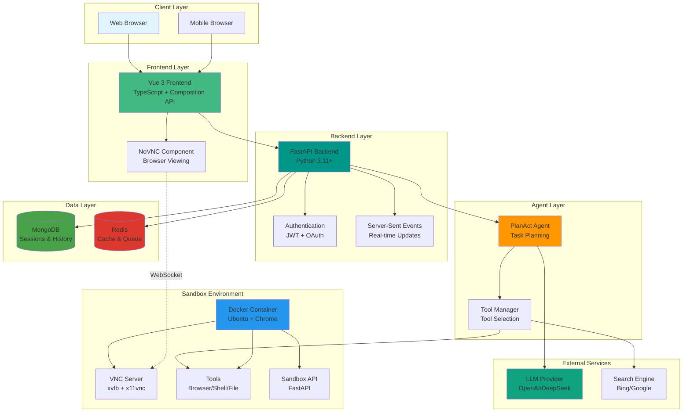

### Component Interaction

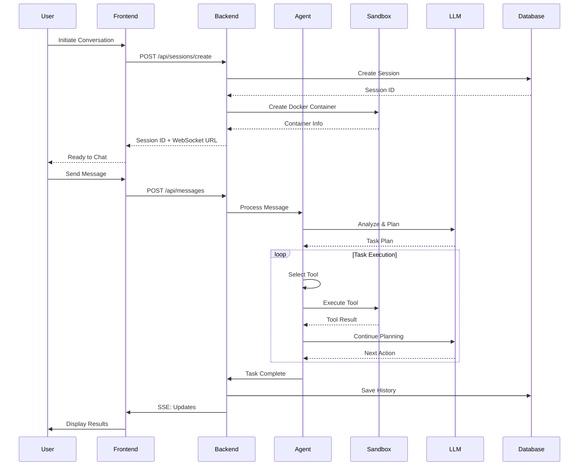

## User Flow

### Authentication & Session Management

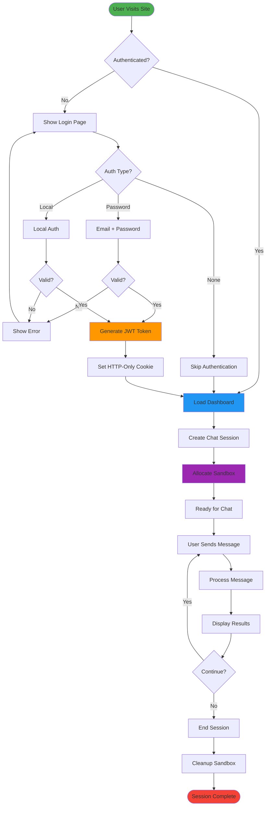

## Authentication Flow

### JWT Authentication Process

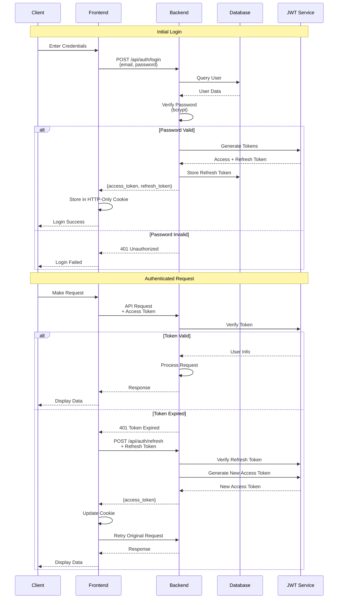

## Task Execution Flow

### Agent Processing Pipeline

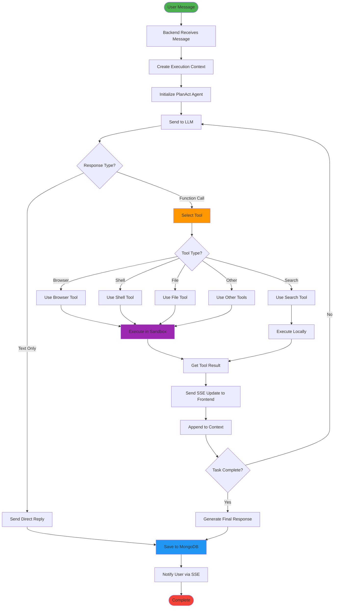

### Sandbox Lifecycle

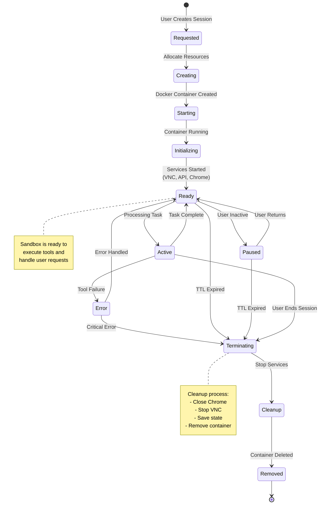

## Deployment Architecture

### Docker Compose Deployment

```mermaid
graph TB
    subgraph "Host Machine"
        subgraph "Docker Network: sheikh-ai-network"
            subgraph "Frontend Container"
                Nginx[Nginx Server<br/>Port: 80]
                VueApp[Vue 3 App<br/>Static Files]
            end
            
            subgraph "Backend Container"
                FastAPI[FastAPI Server<br/>Port: 8000]
                Uvicorn[Uvicorn ASGI]
            end
            
            subgraph "Database Containers"
                MongoDB[MongoDB 7.0<br/>Port: 27017]
                Redis[Redis 7.0<br/>Port: 6379]
            end
            
            subgraph "Dynamic Sandboxes"
                Sand1[Sandbox 1<br/>Ubuntu + Chrome]
                Sand2[Sandbox 2<br/>Ubuntu + Chrome]
                SandN[Sandbox N<br/>Ubuntu + Chrome]
            end
        end
        
        HostPort[Host Port 5173] --> Nginx
        DockerSocket[/var/run/docker.sock] -.-> FastAPI
        
        VueApp --> FastAPI
        FastAPI --> MongoDB
        FastAPI --> Redis
        FastAPI -.Creates/Manages.-> Sand1
        FastAPI -.Creates/Manages.-> Sand2
        FastAPI -.Creates/Manages.-> SandN
        
        Volume1[(mongodb_data)] --> MongoDB
        Volume2[(logs)] --> FastAPI
    end
    
    Internet((Internet)) --> HostPort
    
    style Nginx fill:#009688
    style FastAPI fill:#ff9800
    style MongoDB fill:#47a248
    style Redis fill:#dc382d
    style Sand1 fill:#2496ed
    style Sand2 fill:#2496ed
    style SandN fill:#2496ed
```

### Kubernetes Deployment (Future)

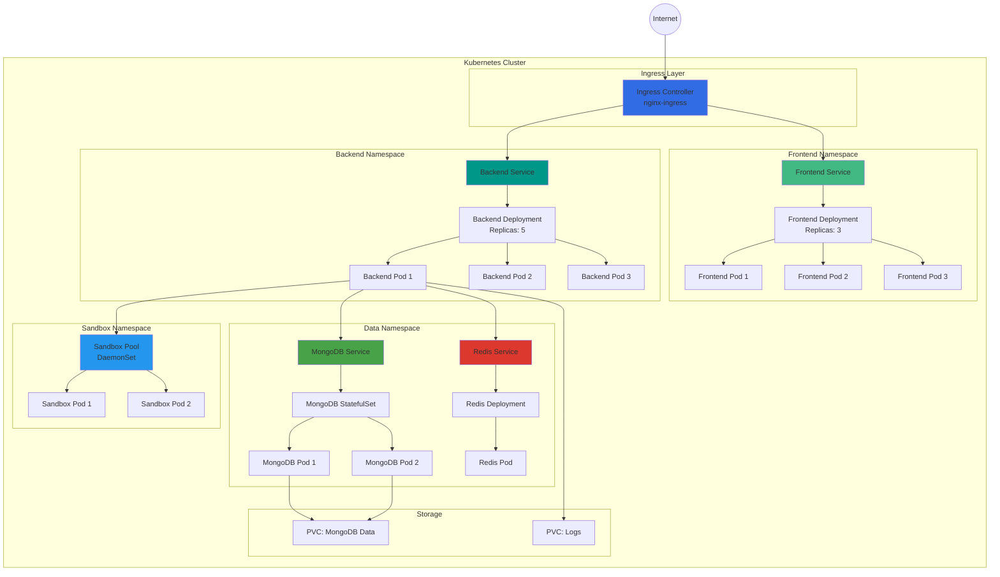

## Development Workflow

### Git Workflow

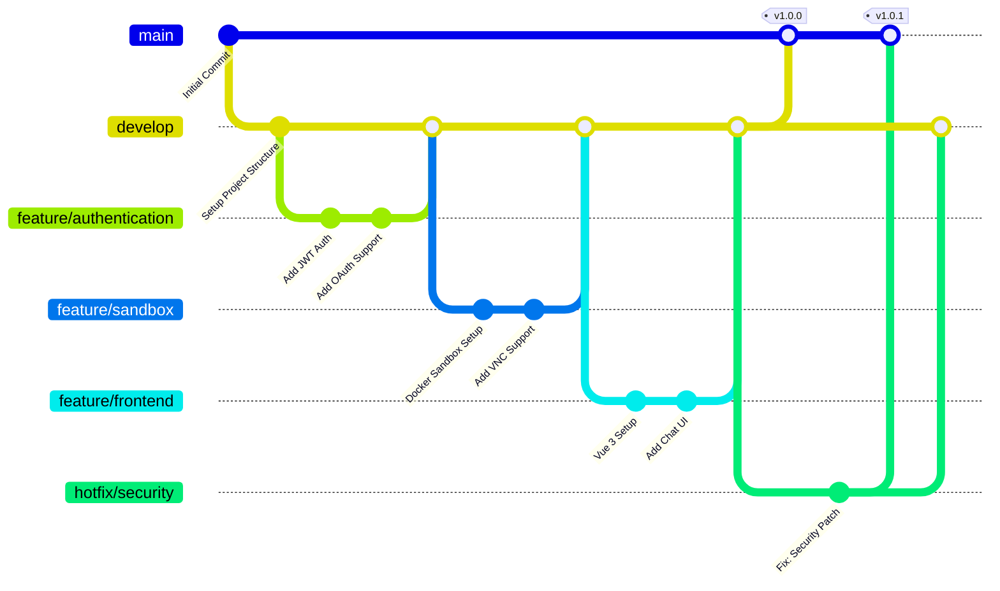

### CI/CD Pipeline

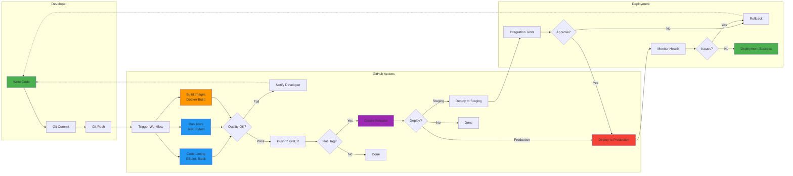

### Local Development Setup

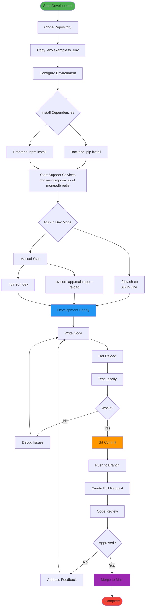

## Data Flow

### Message Processing

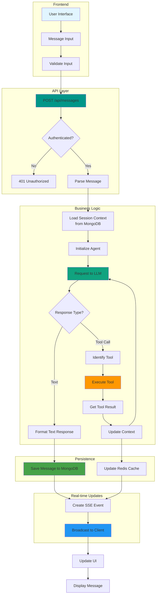

---

## Diagram Legend

### Color Coding

- 🟢 **Green** (#4caf50): Start/Success states
- 🔵 **Blue** (#2196f3): Processing/Active states
- 🟠 **Orange** (#ff9800): Important operations
- 🟣 **Purple** (#9c27b0): Critical operations
- 🔴 **Red** (#f44336): End/Error states
- 🟢 **Teal** (#009688): API/Services
- 🟢 **Green DB** (#47a248): MongoDB
- 🔴 **Red DB** (#dc382d): Redis
- 🔵 **Docker Blue** (#2496ed): Docker/Containers
- 🟢 **LLM Green** (#10a37f): AI/LLM Services

### Component Abbreviations

- **API**: Application Programming Interface
- **SSE**: Server-Sent Events
- **JWT**: JSON Web Token
- **VNC**: Virtual Network Computing
- **LLM**: Large Language Model
- **PVC**: Persistent Volume Claim
- **GHCR**: GitHub Container Registry

---

*This documentation is automatically generated and kept in sync with the codebase.*
